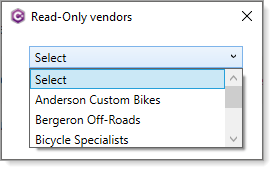

# Learn the basics on immutability

An immutable object gets created once than from therefore afterwards during its lifetime cannot be modified.

When might an immutable object be useful? Look into the .NET Framework at
[TimeZoneInfo.GetSystemTimeZones](https://docs.microsoft.com/en-us/dotnet/api/system.timezoneinfo.getsystemtimezones?view=net-6.0) which 
returns a 
[ReadOnlyCollection](https://docs.microsoft.com/en-us/dotnet/api/system.collections.objectmodel.readonlycollection-1?view=net-6.0)&lt;TimeZoneInfo> which can not be modified.

Now suppose a task requires available time zones given a [DateTimeOffset](https://docs.microsoft.com/en-us/dotnet/api/system.datetimeoffset?view=net-6.0) obained from CommonLibrary.Classes.InternetHelpers.LocalTime() using

```csharp
DateTimeOffset? current = InternetHelpers.LocalTime();
```
Then using

```csharp
DateTimeHelpers.ShowPossibleTimeZones(current.Value)
```

Source

```csharp
public static ImmutableList<string> PossibleTimeZones(this DateTimeOffset offsetTime)
{
    List<string> list = new();
    TimeSpan offset = offsetTime.Offset;

    ReadOnlyCollection<TimeZoneInfo> timeZones = TimeZoneInfo.GetSystemTimeZones();

    list.AddRange(from TimeZoneInfo timeZone in timeZones
        where timeZone.GetUtcOffset(offsetTime.DateTime).Equals(offset)
        select timeZone.DaylightName);

    return list.ToImmutableList();
}
```

This means the caller can not change values returned from `PossibleTimeZones`. Why would someone want to add invalid time zone names? There is no good reason so this is a good use for [ImmutableList](https://docs.microsoft.com/en-us/dotnet/api/system.collections.immutable.immutablelist-1?view=net-6.0).


# Sharing a compiled library

Another use is providing a list, in this case, company names where no other companies may be added.

The base is to create a class with properties that can only be set in the class constructor.

```csharp
public class Vendor
{
    public int Id { get;  }
    public string AccountNumber { get; init; }
    public string DisplayName { get; init; }
    public int CreditRating { get; init; }

    public override string ToString() => DisplayName;

    public Vendor(int id, string accountNumber, string displayName, int creditRating)
    {
        Id = id;
        AccountNumber = accountNumber;
        DisplayName = displayName;
        CreditRating = creditRating;
    }
}
```

Create the list, in this case hard coded while data might come from a secure database table.

```csharp
public static IReadOnlyList<Vendor> Vendors() => new List<Vendor>()
    {
        new (0,"SELECT","Select",0),
        new (1,"ANDERSON0001","Anderson Custom Bikes",2),
        new (2,"BERGERON0001","Bergeron Off-Roads",1),
        new (3,"BICYCLE0001","Bicycle Specialists",1),
        new (4,"CAPITAL0001","Capital Road Cycles",3),
        new (5,"ELECTRON0001","Electronic Bike Co.",1)
    };
```
Normally a developer will not consider a developer adding a new item and will code as follows which is fine if a developer is permitted to add one or more new items.

```csharp
public static List<Vendor> Vendor() => new List<VendorItem>()
{
    new () {Id = 0, AccountNumber = "SELECT", DisplayName = "Select", CreditRating = 1},
    new () {Id = 1, AccountNumber = "ANDERSON0001", DisplayName = "Anderson Custom Bikes", CreditRating = 2},
    new () {Id = 2, AccountNumber = "BERGERON0001", DisplayName = "Bergeron Off-Roads", CreditRating = 1},
    new () {Id = 3, AccountNumber = "BICYCLE0001", DisplayName = "Bicycle Specialists", CreditRating = 2},
    new () {Id = 4, AccountNumber = "CAPITAL0001", DisplayName = "Capital Road Cycles", CreditRating = 3},
    new () {Id = 5, AccountNumber = "ELECTRON0001", DisplayName = "Electronic Bike Co.", CreditRating = 1}
};
```


Provide access to the data

```csharp
public class VendorModel : INotifyPropertyChanged
{
    private readonly CollectionView _vendorEntries;
    private string _vendorEntry;

    public VendorModel()
    {
        IReadOnlyList<Vendor> list = References.Vendors();
        _vendorEntries = new CollectionView(list);
    }

    public CollectionView VendorEntries => _vendorEntries;

    public string VendorEntry
    {
        get => _vendorEntry;
        set
        {

            if (_vendorEntry == value)
            {
                return;
            }

            _vendorEntry = value;

            OnPropertyChanged();
        }
    }

    public event PropertyChangedEventHandler PropertyChanged;
    protected virtual void OnPropertyChanged([CallerMemberName] string propertyName = null)
    {
        PropertyChanged?.Invoke(this, new PropertyChangedEventArgs(propertyName));
    }
}
```

Which is then called in a frontend, here it's a WPF window.

```csharp
public partial class MainWindow : Window
{
    private IntPtr _intPtr;
    private bool _shown;

    public MainWindow()
    {
        InitializeComponent();

        VendorModel vendorModel = new();
        DataContext = vendorModel;
    }
}
```

Followed by binding to a ComboBox

```xml
<ComboBox
    x:Name="VendorsCombobox"
    Grid.Column="1"
    Width="214"
    Height="22"
    Margin="0,14,0,0"
    HorizontalAlignment="Center"
    VerticalAlignment="Top"
    DisplayMemberPath="DisplayName"
    ItemsSource="{Binding Path=VendorEntries}"
    IsSynchronizedWithCurrentItem="True"
    MaxDropDownHeight="80" />
```




# Records

Another option to ensure data can not be changed is to use [records](http://example.com).

**Microsoft docs**

> C# 9 introduces records, a new reference type that you can create instead of classes or structs.

Suppose a requirement is to display a fixed list of countries. Using a class we need the following.

```csharp
public class Country
{
    public int Id { get;  }
    public string Name { get;  }
    public override string ToString() => Name;

    public Country(int identifier, string name)
    {
        Id = identifier;
        Name = name;
    }
}
```

Populate

```csharp
public static IReadOnlyList<Country> Countries() =>
    new List<Country>()
    {
        new(1, "Argentina"),
        new(2, "Austria"),
        new(3, "Belgium"),
        new(21, "Venezuela")
    };
```

Use a record

```csharp
public record CountryRecord(int id, string name);
```

Populate

```csharp
    public static List<CountryRecord> Countries()
    {
        List<CountryRecord> records = new()
        {
            new(1, "Argentina"),
            new(2, "Austria"),
            new(3, "Belgium"),
            new(21, "Venezuela")
        };

        return records;

    }
```

The record and class examples produces list that are read-only while for the record much less coding is required.

# Summary

What has been provided allow a developer to ensure data can not be changed especially when the underlying source code is compile and the other developers do not have access to the code.


# Data scripts

The following [script](https://gist.github.com/karenpayneoregon/7a4ba781b7884be8aa88112260c154a4) (SQL-Server) is required for any of the database operations.